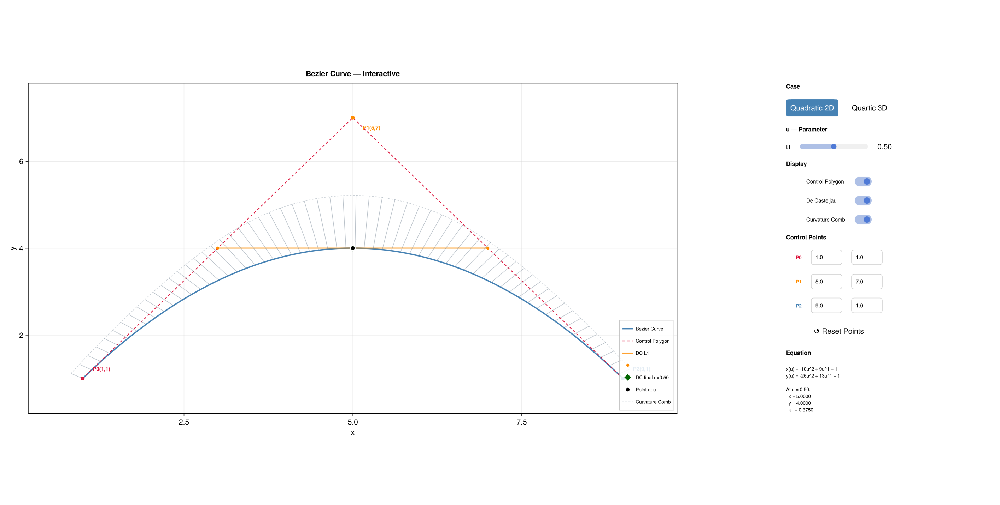
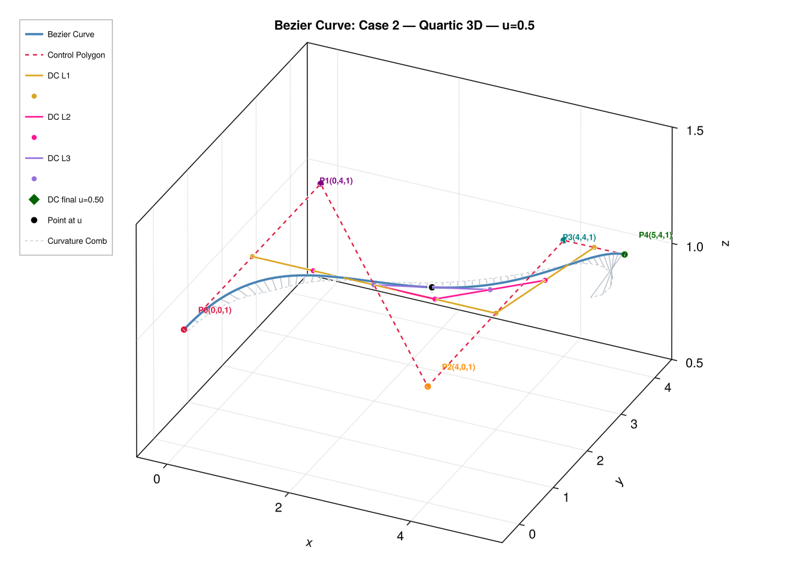

# Curve

A multi-language study of **Bézier curves** — from the algebra
to an interactive 3-D plot — implemented progressively across
four environments.

> *Directed and curated by E.R. Nurwijayadi.
> Code and explanations AI-generated (Claude, claude.ai).*

---

## Table of Contents

- [What This Is](#what-this-is)
- [What You Will Learn](#what-you-will-learn)
- [Preview](#preview)
- [Repository Structure](#repository-structure)
- [Implementations](#implementations)
  - [Julia (primary, fully documented)](#julia-primary-fully-documented)
  - [Python](#python)
  - [Web-based](#web-based)
  - [Jupyter Notebook](#jupyter-notebook)
  - [Scilab](#scilab)
  - [Spreadsheet](#spreadsheet)
- [Getting Started — Julia](#getting-started--julia)
- [Documentation](#documentation)
- [About This Project](#about-this-project)

---

## What This Is

This repository works through Bézier curve mathematics
and implementation across six different environments.
The same curve — the same algebra, the same geometry,
the same visual result — is built from scratch in each one.

The purpose is understanding, not performance.
Every implementation is a deliberate step:
start with the polynomial on paper,
build it in a spreadsheet,
then code it,
then plot it,
then make it interactive.

The Julia implementation is the most complete,
with 15 scripts and a full set of LaTeX explanation documents.

---

## What You Will Learn

- What a Bézier curve is and how control points shape it
- The **Bernstein polynomial** formula and how to evaluate it
- The **De Casteljau algorithm** — the geometric construction method
- The **matrix method** $P(u) = U \cdot M \cdot G$
- **Curvature** — how to compute and visualise it
- How to build an **interactive UI** in Julia with sliders,
  toggles, and live-editable control points

---

## Preview

**Interactive UI** — Case 1: Quadratic 2-D with curvature comb
and De Casteljau construction. All overlays are toggleable live.



**3-D curve** — Case 2: Quartic 3-D with De Casteljau levels
and curvature comb. Fully rotatable in GLMakie.



---

## Repository Structure

```
curve/
└── bézier/
    ├── julia/              Julia scripts (01–35)
    ├── julia.docs/         LaTeX source + compiled PDF explanations
    ├── python/             Python scripts
    ├── web/                Web-based implementation (HTML/JS)
    ├── jupyter/            Jupyter notebook
    ├── scilab/             Scilab scripts
    └── spreadsheet/        LibreOffice Calc workbook
```

---

## Implementations

### Julia (primary, fully documented)

**15 scripts** covering algebra, plotting, De Casteljau,
curvature, and an interactive UI.

| Script | Name | Output | Key concept |
|--------|------|--------|-------------|
| 01 | bezier-algebra | Text | Bernstein, hand-rolled Poly type |
| 02 | bezier-sympy | Text | Rational{Int}, Symbolics.jl |
| 03 | bezier-matrix-pedagogical | Text | Matrix method, step by step |
| 04 | bezier-matrix-straight | Text | Clean matrix output |
| 05 | bezier-matrix-sympy-text | Text | Symbolic + rational combined |
| 11p | bezier-quadratic-plots | 2-D plot | Plots.jl |
| 11m | bezier-quadratic-makie | 2-D plot | CairoMakie |
| 12p | de-casteljau-plots | 2-D plot | De Casteljau, Plots.jl |
| 12m | de-casteljau-makie | 2-D plot | De Casteljau, CairoMakie |
| 21 | bezier-quartic-makie | 3-D static | Axis3, elevation/azimuth |
| 22 | de-casteljau-makie (3D) | 3-D static | De Casteljau quartic |
| 31 | bezier-generic | 2-D/3-D | Any degree, GLMakie |
| 32 | bezier-symbolic | 2-D/3-D | Symbolic evaluation |
| 34 | bezier-curvature | 2-D/3-D | Curvature comb |
| 35 | bezier-interactive | UI | Sliders, toggles, textboxes |

> Script 33 is intentionally absent from the Julia series.
> It exists in the Python/Jupyter series as an interactive
> `ipywidgets` notebook. Script 35 covers the same idea
> natively in Julia.

**Required packages** (install once):

```julia
import Pkg; Pkg.add("Symbolics")
import Pkg; Pkg.add("Plots")
import Pkg; Pkg.add("CairoMakie")
import Pkg; Pkg.add("GLMakie")
```

**Running a script:**

```bash
julia bézier/julia/11-bezier-quadratic-plots.jl
```

Scripts 01–05 print to the terminal.
Scripts 11–35 open a plot window and save a PNG.
Press **Enter** in the terminal to close the window.

**The CASE switch** — scripts 01–05, 31, 32, and 34 have
a single line near the top:

```julia
const CASE = 2   # 1 = Quadratic 2D,  2 = Quartic 3D
```

This is the only line you need to change to switch cases.

---

### Python

A Python implementation of the same Bézier curve series
using NumPy and Matplotlib/Seaborn.
Located in `bézier/python/`.

---

### Web-based

A browser-based interactive curve editor built with
HTML, CSS, and JavaScript.
No installation required — open in any browser.
Located in `bézier/web/`.

---

### Jupyter Notebook

Interactive Python notebooks with widgets (`ipywidgets`),
including the script-33 interactive curve editor
that inspired the Julia script-35 UI.
Located in `bézier/jupyter/`.

---

### Scilab

A Scilab implementation covering the core curve evaluation
and plotting.
Located in `bézier/scilab/`.

---

### Spreadsheet

Where it all started — a LibreOffice Calc workbook
implementing Bézier evaluation in cells,
with formulas and charts.
Located in `bézier/spreadsheet/`.

---

## Getting Started — Julia

**1. Clone the repository**

```bash
git clone https://github.com/epsi-rns/curve.git
cd curve
```

**2. Install Julia packages**

```julia
import Pkg
Pkg.add(["Symbolics", "Plots", "CairoMakie", "GLMakie"])
```

**3. Run your first script**

```bash
julia bézier/julia/11-bezier-quadratic-plots.jl
```

**4. Try the interactive UI**

```bash
julia bézier/julia/35-bezier-interactive.jl
```

> **Note:** GLMakie (scripts 31, 32, 34, 35) requires a
> desktop environment with GPU-capable display.
> On a headless server, use the CairoMakie scripts
> (11m, 12m, 21, 22) instead.

---

## Documentation

The `bézier/julia.docs/` folder contains a complete set of
LaTeX explanation documents — one per script — covering
the code, the mathematics, and the visual output.

| Document | Contents |
|----------|----------|
| `00-bezier-overview.pdf` | Start here — overview and reader's guide |
| `01-bezier-algebra-code-explained.pdf` | Script 01 code walkthrough |
| `01-bezier-algebra-output-explained.pdf` | Script 01 output walkthrough |
| … | One document per script |
| `40-bezier-code-analysis.pdf` | Series-wide architecture and pattern analysis |

Each document is self-contained and can be read independently.
The LaTeX source files are included alongside the PDFs.

**Reading order by goal:**

| Goal | Start here |
|------|-----------|
| Understand the Bézier polynomial | `01-bezier-algebra` |
| First plot | `11-bezier-quadratic-plots` or `11-bezier-quadratic-makie` |
| De Casteljau visualised | `12-de-casteljau-plots` |
| 3-D curve | `21-bezier-quartic-makie` |
| Generic code (any degree) | `31-bezier-generic` |
| Curvature | `34-bezier-curvature` |
| Interactive UI | `35-bezier-interactive` |
| Full architecture review | `40-bezier-code-analysis` |

---

## About This Project

This project started as a homework task — a Bézier curve
built in a LibreOffice Calc spreadsheet.
It grew from there: Python, a web interface, a Jupyter
notebook, Scilab, and finally Julia.

Julia was the final choice for its combination of
mathematical expressiveness, clean syntax, and the
GLMakie interactive UI framework.
The gap between the algebra and a working interactive
plot turned out to be large enough to justify a
step-by-step documented series.

**Goal:** understanding Bézier curves completely,
with nothing skipped — and making that understanding
available to anyone who wants it.

The material is for:
- Anyone learning Bézier curves from first principles
- Anyone learning Julia through a concrete project
- Anyone interested in LaTeX documentation alongside code
- Anyone exploring how to use AI (Claude) as a
  collaborative tool for a sustained technical project

**There is no intention to show off.**
The series exists because understanding is more valuable
when shared.

### Authorship and AI

All Julia scripts and LaTeX documentation in this series
were written by **Claude** (claude.ai), an AI assistant
made by Anthropic.

- **E.R. Nurwijayadi** — conceived the series, chose the
  progression, made all design decisions, reviewed every
  document, and directed what was written and how.
- **Claude** — wrote the code and explanations based on
  those directions.

This is stated clearly because the author does not wish
to claim credit for work done by an AI.
It is also offered as a demonstration of what is possible
when a human directs an AI collaboratively on a
sustained technical project.

---

*E.R. Nurwijayadi · [`epsi-rns`](https://github.com/epsi-rns)*
